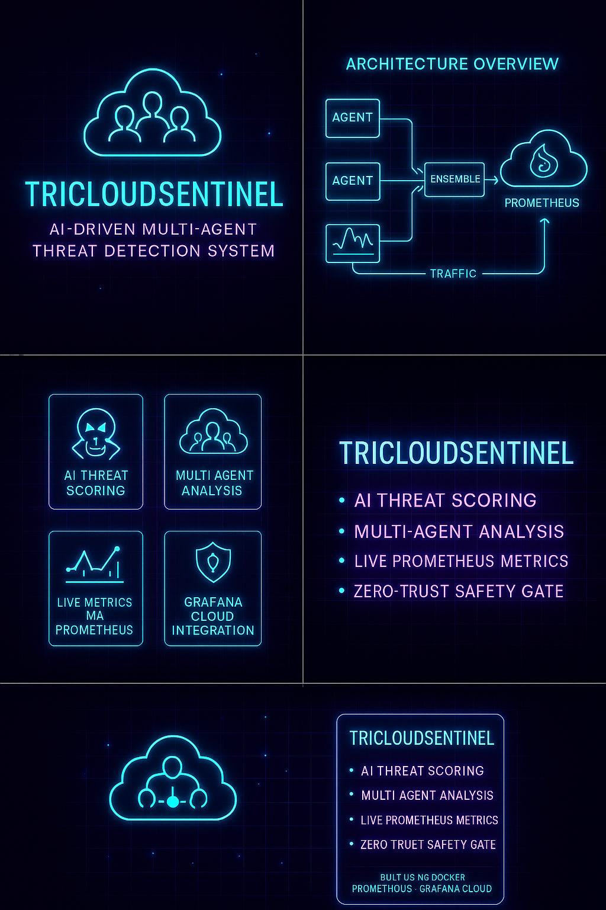

# 🛰️ TriCloudSentinel  
### **AI-Driven Multi-Agent Threat Detection System with Prometheus + Grafana Cloud**

TriCloudSentinel is a **fully containerized, distributed cybersecurity analysis system** that uses:

- 🕵️ **Three independent AI-powered Python agents**  
- 🔗 **A central Ensemble engine that merges results**  
- 🛡️ **A Safety Gate that blocks malicious payloads**  
- 📊 **Prometheus metrics exported to Grafana Cloud**  
- 🐳 **Full Docker Compose orchestration**

This project simulates **real-world cloud security detection pipelines**, showing how distributed agents, ensemble intelligence, and automated remediation can work together in a defensive system.

---

# 🚀 Architecture Overview


TriCloudSentinel follows a modular detection pipeline:

1. **Three Detection Agents**  
   Each agent processes incoming payloads independently and assigns a threat score.

2. **Ensemble Engine**  
   Combines scores, analyzes 60-second windows, and detects anomalies.

3. **Safety Gate**  
   Automatically blocks malicious IPs (simulated for Azure, GCP, IBM).

4. **Prometheus + Grafana Cloud**  
   All metrics are exported for dashboards, anomaly charts, and security observability.

---

# 1️⃣ Detection Agents — Independent AI Scanners



Each agent:
- Accepts payloads  
- Computes threat score (0–1)  
- Sends events to the **Ensemble Engine**  
- Logs & exposes `/health` and `/metrics`

---

# 2️⃣ Ensemble Engine — Central Intelligence


Responsible for:
- Maintaining a **60-second sliding window**  
- Computing **average threat score**  
- Detecting anomalies  
  - Condition: **score > 0.60 AND ≥ 2 events**  
- Forwarding incidents to the Safety Gate  
- Exporting Prometheus metrics  

---

# 3️⃣ Safety Gate — Automated Remediation Layer


Simulated responses:
- Azure → Block IP  
- GCP → Block IP  
- IBM → Block IP  

⚠️ *This is a simulation for demo purposes only. No real cloud accounts are modified.*

---

# 4️⃣ Observability — Prometheus + Grafana Cloud


Prometheus scrapes:
- `http://ensemble:9000/metrics`

If configured, metrics are forwarded to **Grafana Cloud** using `remote_write`.

### Example Prometheus remote_write config:

```yaml
remote_write:
  - url: https://prometheus-prod-13-prod-ap-south-1.grafana.net/api/prom/push
    basic_auth:
      username: <YOUR_GRAFANA_UUID>
    password_file: /etc/prometheus/secrets/grafana_api_token
```

---

# 🧪 Local Setup (Quick Start)

From the repository root:

```bash
# 1) Start all services
docker compose up -d --build

# 2) Check running containers
docker compose ps

# 3) Test ensemble health
curl -i http://localhost:9000/health

# 4) View Prometheus metrics
curl -i http://localhost:9000/metrics
```

---

# 📌 What This Project Demonstrates

- Real-time multi-agent threat scoring  
- Ensemble-based anomaly detection  
- Automated remediation (simulated cloud blocking)  
- Production-grade observability pipeline  
- Containerized distributed microservices  
- Integration with Grafana Cloud via `remote_write`

---

# ⭐ Future Enhancements  
- Real cloud API integration (AWS/GCP/Azure)  
- L7 threat signatures  
- ML-based score smoothing  
- Kafka event streaming option  

---

# 🏁 Author  
**J Rishi — SkySentinel-AI**  
*DevSecOps • Cloud Security • AI-Driven Automation*

---

# 🔐 Motto  
### **Secure everything. Automate anything.**
